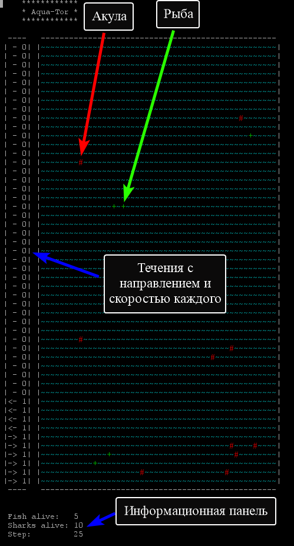

# AquaTorus

Для удобства запуска можно использовать start.bat файл, который лежит рядом с папкой target. 
В нем прописаны команды входа в папку target и правильного запуска приложения с помощью javaw. 
***
Конфигурационные данные находятся в configure.xml в папке classes рядом с запускаемым приложением. 
Входные данные вводятся в input.xml в той же папке рядом с конфигурационными данными.
***
Тестовые XML-файлы уже предоставляются по умолчанию.
***
При запуске открывается дополнительная консоль, в которой пошагово визуализируется симуляция жизни в Акваторе/Аквариуме.
На каждом шаге помимо визуализации данные записываются в статистический XML-файл, а по завершении симуляции все эти данные
формируются в CSV-файл. 
***
Размер поля ограничивается размерами вашего экрана. При этом в конфигурационном файле можно задавать любые размеры (сейчас там указано поле 1000 * 1000). Если указаные размеры экрана, то они будут уменьшены до максимально возможных. Количество рыб также может быть введено любым, но на каждую рыбу должно быть не мене 3 свободных клеток игрового поля. 
***
!Направление оси для задания координат потоков: снизу вверх!
***
